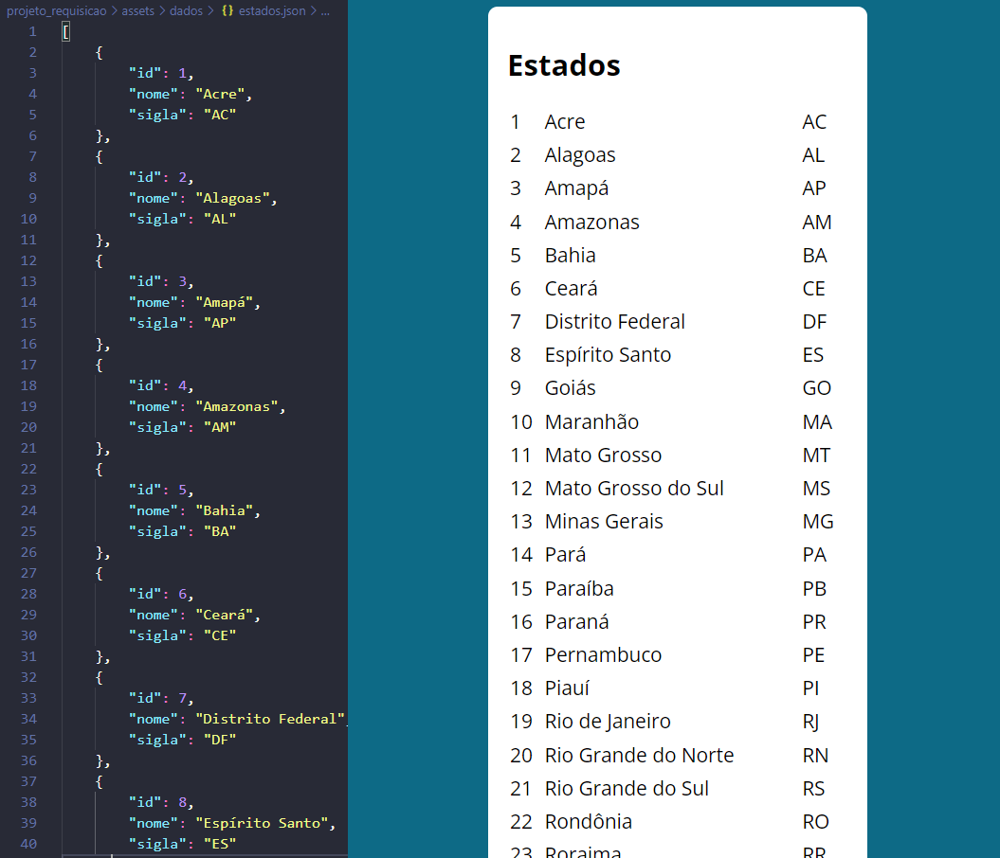

  <a href="#Projeto">Projeto</a> ◦ 
  <a href="#Descrição">Descrição</a> ◦ 
  <a href="#Status">Status</a> ◦ 
  <a href="#Sobre">Sobre</a> ◦ 
  <a href="#Tecnologias">Tecnologias</a> ◦ 
  <a href="#Link">Link</a> ◦ 
  <a href="#Autor">Autor</a>

# Projeto
Requisições

# Descrição
Este projeto foi feito com o intuíto de verificar algumas formas de fazer uma requisição: XMLHttpRequest, Promises, Fetch e Axios. O objetivo é ler
um arquivo em formato JSON que está em /assets/dados/estados.json, que se trata de um array de objetos onde cada um possui id, estado e sigla. Após
requisitar o arquivo é criada uma tabela com colunas id, estado e sigla.

  

# Status
Finalizado

# Sobre
Aplicação da Web desenvolvida com a finalidade de aprendizagem dos conteúdos de HTML5, CSS e JavaScript. 
O HTML da página é organizado da seguinte forma:
- head:
    - adiciona o título;
    - relaciona o arquivo de css chamado "style.css", que faz as configurações dos estilos.
- body
    - uma tag section;  
    - uma tag h1 para o título;  
    - uma tag div na qual será adicionada a tabela;  
    - ao final são feitas relações com o arquivos em JavaScript:
    - para a requisição do tipo XMLHttpRequest é criado o arquivo main.js
    - para a requisição do tipo Promises é criado o arquivo main_promises.js
    - para a requisição do tipo Fetch é criado o arquivo main_fetch.js
    - para a requisição do tipo Axios é criado o arquivo main_axios.js
O documento "main.js" possui as seguintes instruções:  
    - é instanciado o método através de "new XMLHttpRequest()" e armazenado em "xhr";  
    - é aberta uma requisição através de "xhr.open";  
    - é adicionado um evento para "escutar" quando a requisição foi carregada através de "addEventListener('load')";  
    - são verificados os status e para cada qual chamadas as funções de sucesso e erro;  
    - após criada a função, a mesma é requisitada, passando como parâmetros "method", "url" e as funções de sucesso e erro;  
    - as requisições do tipo fetch e axios são parecidas entre si e mais simples que a anterior.

# Link
A hospedagem foi feita utilizando o GitHub, que oferece serviço de hospedagem de sites.
- [URL do Site](https://epfolletto.github.io/requisicao/)

# Tecnologias

  

# Autor
Evandro Paulo Folletto

  
  
  

